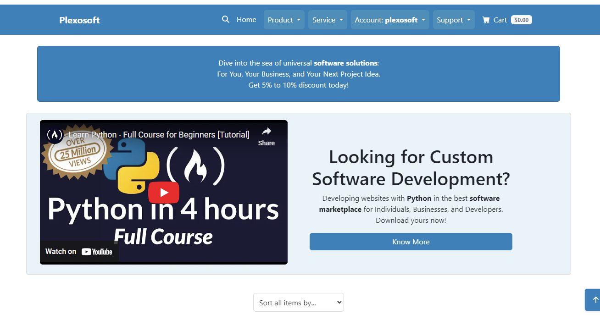

# Actual Features Explained

We are extremely pleased with our accomplishments, particularly given initial concerns about time constraints due to personal reasons, as well as external challenges like government decisions and unexpected changes toward the end.

Reflecting on the project, it's clear that each feature offers room for enhancement and future development, thanks to its modular structure. This iteration introduces simplified design elements and includes all CRUD functionalities: creating products, services, and downloads (admin); reading frontend items (admin & user); updating items (admin); deleting accounts (users); and consistently providing appropriate feedback.

??? info "Homepage Features"
    ## Homepage

    ### Header & CTA Section
    The header introduces users to the platform with a clear call-to-action (CTA) that encourages them to either participate or learn more about the software marketplace.

    

    ### Product & Service Cards & See More Button
    The section showcases a highlighted row of product and service cards, each with a brief description and metrics to facilitate an informed choice. A "See More" option allows users to view additional entries.

    

    ### Product Cards & See More
    Displays only Product cards. The "See More" link directs users to a comprehensive list of all Product entries.

    

    ### Service Cards & See More
    Highlights only Service cards. Users can explore more Service entries by clicking on "See More."

    

    ### Footer
    Contains essential links, platform information, and other resources for users to navigate and understand the platform better.

    

??? info "Single Product/Service Page"
    ## Single Product/Service Page

    

    ### Card Features
    This section details the specifics of the instance, including its description, price, category, likes, comments, and more.

    ### Add to Cart, Like & Comment Feedback
    This feature informs users of the outcome of their actions related to the instance they selected.

    ### Cart & Payment Process
    The cart accumulates the user's choices, allowing them to check out once they have finished selecting their products or services. The cart is versatile; users can increase or decrease the number of items, as well as remove them entirely. Currently, only Stripe payments are accepted, and progressive disclosure is implemented throughout the process.

??? info "Account Management"
    ## Account Management

    ### Login
    The login feature provides a secure interface for users to access their accounts, either manually or through Google login.

    

    ### Signup
    This feature allows new users to join the platform by creating an account, either manually or through Google login.

    

??? info "User Dashboard"
    ### User Dashboard

    

    #### My Settings
    Here, users can modify their personal information, preferences, and limited account settings.

    

    #### My Orders
    This section displays a list of orders placed by the user, showing their status, the ability to update them, and other important information.

    

    #### My Likes & My Comments
    Provides an overview of the likes & comments of the user, detailing their action taken.

    #### Likes
    

    #### Comments
    

    #### My Role
    Describes the user's permissions, roles, and capabilities within the platform.

    

### Admin Dashboard

#### My Settings
In this section, admins can adjust their personal information, preferences, and account settings, which are more extensive compared to regular users.

#### User Management (Future Feature)
- NA

#### Order Management
This page displays all created orders. Edit and details capabilities for each entry are available. Additionally, there is a cleaning button for removing old, unfinished orders.

#### Asset Management
Here you'll find options to manage products and services. This section shows how many items have been created and also provides the option to create new ones.

#### File Management
In this section, admins can manage or create download instances that can then be linked to their created products and services.

#### Comment & Like Management
This area allows the admin to view and manage comments as well as theoretically control likes. The like-update function is active, although changes are not reflected elsewhere in this iteration.

#### My Role
This section details the administrative permissions and capabilities available to the user.

---

## Digital Downloads Marketplace Logic

#### User Purchases a Product or Service
This process allows users to make purchases using Stripe and create orders. After a successful payment, users can comment and like the product or service they purchased, as well as download the associated file from their user dashboard.

#### Order Instances
This feature allows users to visualize their orders, even if the order was not completed.

---

## Support

### FAQ
A section containing frequently asked questions about the platform. It may also contain videos to assist users in troubleshooting common issues and learning more about the marketplace.

### Contact
Provides users with the means to get in touch with platform support for technical issues, feedback, or inquiries.

---
