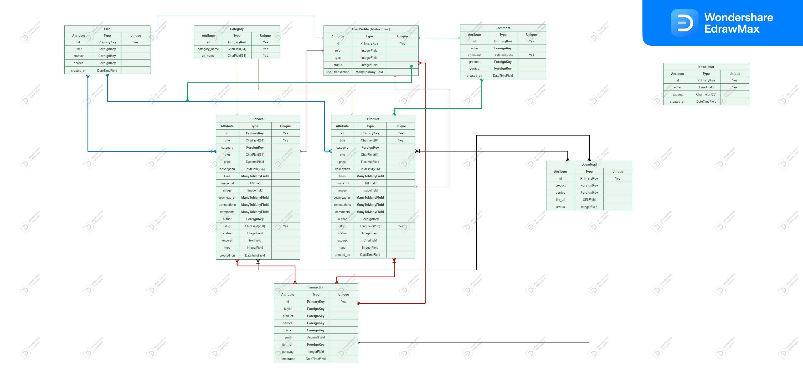

## Entity Relationship Diagram (ERD)

During our [Ideation Process](../design-thinking/ideate/ideate.md/?h=database#database), as anticipated, we chose the following Database Models (13):

- UserProfile
- Product
- Service
- Download
- Category
- CodeType
- ServiceType
- Order
- OrderLineItem
- OrderDeletionRecord
- Like
- Comment
- Newsletter

The principle of separation of concerns might seem self-explanatory, but ensuring organized data while respecting its integrity is pivotal. This approach not only facilitates future project scalability but also simplifies the development process.

## Diagram

<details>
<summary>Diagram Image</summary>

- [Live Version](https://www.edrawmax.com/online/share.html?code=de920716472111ee8de00a951ba8b83d)



</details>

## Table Model
### UserProfile Model

<details>
<summary>UserProfile Model</summary>

| Attribute         | Type             | Unique  | Relationship  | Model Linked To                            |
|-------------------|------------------|---------|---------------|-------------------------------------------|
| email              | IntegerField     | Yes       | -             | -                                         |
| role              | IntegerField     | -       | -             | -                                         |
| type              | IntegerField     | -       | -             | -                                         |
| status            | IntegerField     | -       | -             | -                                         |

</details>

### Comment Model

<details>
<summary>Comment Model</summary>

| Attribute     | Type              | Unique  | Relationship  | Model Linked To                 |
|---------------|-------------------|---------|---------------|--------------------------------|
| writer        | **ForeignKey**    | -       | Many to one   | UserProfile Model               |
| comment       | TextField(256)    | Yes     | -             | -                              |
| product       | **ForeignKey**    | -       | Many to one   | Product Model                  |
| service       | **ForeignKey**    | -       | Many to one   | Service Model                  |
| status            | IntegerField     | -       | -             | -                                         |
| instance            | IntegerField     | -       | -             | -                                         |
| created_on    | DateTimeField         | -       | -             | -                              |

</details>

### Like Model

<details>
<summary>Like Model</summary>

| Attribute     | Type              | Unique  | Relationship  | Model Linked To                 |
|---------------|-------------------|---------|---------------|--------------------------------|
| liker         | **ForeignKey**    | -       | Many to one   | UserProfile Model               |
| product       | **ForeignKey**    | -       | Many to one   | Product Model                  |
| service       | **ForeignKey**    | -       | Many to one   | Service Model                  |
| status            | IntegerField     | -       | -             | -                                         |
| instance            | IntegerField     | -       | -             | -                                         |
| created_on    | DateTimeField         | -       | -             | -                              |

</details>

### NewsLetter Model

<details>
<summary>NewsLetter Model</summary>

| Attribute     | Type              | Unique  | Relationship  | Model Linked To                 |
|---------------|-------------------|---------|---------------|--------------------------------|
| email         | EmailField        | Yes     | -             | -                              |
| excerpt       | CharField(128)    | -       | -             | -                              |
| created_on    | DateTimeField         | -       | -             | -                              |

</details>

### CodeType Model

<details>
<summary>CodeType Model</summary>

| Attribute      | Type            | Unique | Relationship | Model Linked To |
|----------------|-----------------|--------|--------------|-----------------|
| code           | CharField(64)   | Yes    | -            | -               |

</details>

### ServiceType Model

<details>
<summary>ServiceType Model</summary>

| Attribute      | Type            | Unique | Relationship | Model Linked To |
|----------------|-----------------|--------|--------------|-----------------|
| service        | CharField(64)   | Yes    | -            | -               |

</details>

### Category Model

<details>
<summary>Category Model</summary>

| Attribute      | Type            | Unique | Relationship | Model Linked To |
|----------------|-----------------|--------|--------------|-----------------|
| category_name  | CharField(64)   | Yes    | -            | -               |
| alt_name       | CharField(64)   | Yes    | -            | -               |

</details>

### Product Model

<details>
<summary>Product Model</summary>

| Attribute       | Type                   | Unique  | Relationship      | Model Linked To                          |
|-----------------|------------------------|---------|-------------------|------------------------------------------|
| title           | CharField(64)          | Yes     | -                 | -                                        |
| sku             | CharField(64)          | Yes     | -                 | -                                        |
| price           | DecimalField(6)           | -       | -                 | -                                        |
| description     | TextField(528)         | -       | -                 | -                                        |
| status          | IntegerField           | -       | -                 | -                                        |
| category        | **ForeignKey**         | -       | Many to one       | Category Model                           |
| excerpt         | CharField(264)         | -       | -                 | -                                        |
| type            | IntegerField           | -       | -                 | -                                        |
| instance        | IntegerField           | -       | -                 | -                                        |
| code            | **ManyToManyField**    | -       | Many to many      | CodeType                                 |
| service         | **ManyToManyField**    | -       | Many to many      | ServiceType                                 |
| preview         | URLField(1024)         | Yes       | -                 | -                                        |
| docs            | URLField(1024)         | Yes       | -                 | -                                        |
| slug            | SlugField(200)         | Yes     | -                 | -                                        |
| image           | ImageField             | -       | -                 | -                                        |
| image_url       | URLField(1024)         | -       | -                 | -                                        |
| author          | **ForeignKey**         | -       | Many to one       | UserProfile Model                        |
| created_on      | DateTimeField          | -       | -                 | -                                        |
| likes           | **ManyToManyField**    | -       | Many to many      | Like Model                               |
| comments        | **ManyToManyField**    | -       | Many to many      | Comment Model                            |
| orders    | **ManyToManyField**    | -       | Many to many      | Order Model |
| download_url    | **ManyToManyField**    | -       | Many to many      | Download Model                           |

</details>

### Service Model

<details>
<summary>Service Model</summary>

| Attribute       | Type                   | Unique  | Relationship      | Model Linked To                          |
|-----------------|------------------------|---------|-------------------|------------------------------------------|
| (Same fields as the Product Model, subject to scalability in the future)        |         |                   |                                          |

</details>

### Download Model

<details>
<summary>Download Model</summary>


| Attribute      | Type            | Unique | Relationship | Model Linked To             |
|----------------|-----------------|--------|--------------|-----------------------------|
| file_name        | CharField(64)  | Yes      | Many to one  | Product Model               |
| product        | **ForeignKey**  | -      | Many to one  | Product Model               |
| service        | **ForeignKey**  | -      | Many to one  | Service Model               |
| file       | FileField  | -      | -            | -                           |
| status         | IntegerField    | -      | -            | -                           |
| token         | UUIDField    | Yes      | -            | -                           |
| download_token      | CharField(12)    | Yes      | -            | -                           |
| created_on         | DateTimeField    | -      | -            | -                           |

</details>

### Order Model

<details>
<summary>Order Model</summary>

| Attribute      | Type            | Unique | Relationship | Model Linked To             |
|----------------|-----------------|--------|--------------|-----------------------------|
| status         | IntegerField    | -      | -            | -                           |
| order_number     | CharField(32)    | -      | -            | -                           |
| buyer_profile  | **ForeignKey**  | -      | Many to one  | UserProfile Model           |
| full_name         | CharField(50)    | -      | -            | -                           |
| email         | EmailField(254)    | -      | -            | -                           |
| phone_number      | CharField(20)    | -      | -            | -                           |
| country      | CountryField    | -      | -            | -                           |
| date      | DateTimeField    | -      | -            | -                           |
| order_total      | DecimalField(10)    | -      | -            | -                           |
| grand_total      | DecimalField(10)    | -      | -            | -                           |
| stripe_pid      | CharField(254)    | -      | -            | -                           |
| gateway        | IntegerField    | -      | -            | -                           |

</details>

### OrderLineItem Model

<details>
<summary>OrderLineItem Model</summary>

| Attribute      | Type            | Unique | Relationship | Model Linked To             |
|----------------|-----------------|--------|--------------|-----------------------------|
| order         | **ForeignKey**    | -      | Many to one       | Order Model                           |
| product       | **ForeignKey**    | -       | Many to one   | Product Model                  |
| service       | **ForeignKey**    | -       | Many to one   | Service Model                  |
| quantity       | IntegerField    | -       | -   | -                  |
| lineitem_total       | DecimalField(6)    | -       | -   | -                  |

</details>

### OrderDeletionRecord Model

<details>
<summary>OrderDeletionRecord Model</summary>

| Attribute      | Type            | Unique | Relationship | Model Linked To             |
|----------------|-----------------|--------|--------------|-----------------------------|
| timestamp         | DateTimeField    | -      | -            | -                           |
| initiated_by         | **ForeignKey**    | -      | Many to one      |  UserProfile Model     |

</details>

## Developer Experience

- Since we are using the abstract user we had to add our changes into our settings.py:

```py
AUTH_USER_MODEL = 'homepage.UserProfile'
```
